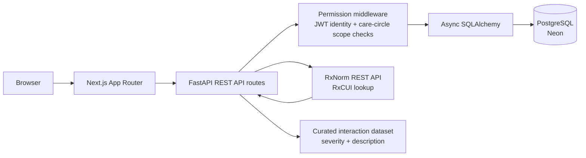

# Aegis

Cross-specialist care coordination with patient-owned access controls and medication safety checks.

[Live demo](https://your-aegis-deployment.vercel.app)

[](https://nextjs.org/) [](https://fastapi.tiangolo.com/) [](https://www.postgresql.org/)

## The Problem

Patients who see multiple specialists often become the only link between separate care teams. Doctors may not see one another's prescriptions, diagnoses, or testing decisions, allowing dangerous drug interactions and duplicate tests to go undetected.

## What Aegis Does

- Gives patients scoped, revocable control over which care partners can access their records.
- Makes prescriptions and other clinical entries visible across active care-circle members.
- Checks newly added medications against active medications from other doctors using RxCUI-based matching.
- Records access and record-changing actions in an audit trail that patients can review by actor and timestamp.

## Architecture



The permission middleware is the policy boundary between API handlers and database access. It verifies the authenticated user, patient ownership, active care-circle membership, and the required permission scope before protected patient-record queries proceed.

## Tech Stack

| Layer | Technology |
| --- | --- |
| Frontend | Next.js 16.2.12 App Router, React 19, TypeScript, Tailwind CSS 4, shadcn/ui |
| Frontend state and forms | Zustand, Axios, React Hook Form, Zod, Sonner, date-fns, lucide-react |
| Backend | Python 3.14, FastAPI, Uvicorn |
| Persistence | PostgreSQL, SQLAlchemy 2 async, asyncpg, Alembic |
| Database hosting | Neon PostgreSQL for the configured hosted database; PostgreSQL 17 is available for local Docker development |
| Authentication | JWT access/refresh tokens with `python-jose`, bcrypt password hashing via Passlib |
| Authorization | FastAPI dependencies and centralized care-circle permission middleware |
| Medication normalization | RxNorm REST API for RxCUI lookup |
| Interaction detection | Curated RxCUI pair dataset in `backend/app/services/interaction_data.py` |
| Deployment | Docker, Render backend deployment, Vercel frontend deployment, GitHub Actions CI |

## Key Technical Decisions

### Centralized permission middleware

Patient-record access is enforced through `verify_patient_access` and `require_patient_access` rather than reimplementing the same checks in every route. This keeps patient ownership, active-circle status, and `full`/`notes_only`/`prescriptions_only` scope behavior consistent, while route handlers remain responsible for role-specific actions such as creating entries or resolving flags.

### Curated interaction data instead of a live interaction API

RxNorm remains useful for normalizing medication names to RxCUIs, but RxNav's drug-drug interaction features were discontinued on January 2, 2024. DrugBank's free tier was retired in March 2026, making an unauthenticated, always-available interaction service unsuitable for this MVP. A small curated dataset provides deterministic demo behavior and keeps the interaction-checking boundary explicit; it is not intended to replace a licensed clinical decision-support database in production. [RxNav FAQ](https://lhncbc.nlm.nih.gov/RxNav/information/FAQs.html) · [DrugBank API documentation](https://docs.drugbank.com/v1/)

### RxCUI-based medication matching

Medication names are not reliable identifiers: the same ingredient can appear under different brands, strengths, and formulations. Aegis resolves names through RxNorm and compares ingredient-level RxCUIs, allowing the interaction dataset to match normalized concepts instead of fragile user-entered strings.

### Append-only audit trail

Audit records capture the actor, patient, action, optional entry, metadata, and timestamp. Actions log within the same database transaction as the underlying change, while the API exposes only patient-owned read access and no update or delete route for audit records. This preserves an accountable history rather than allowing the history itself to be rewritten through the application.

## Screenshots

<!-- Replace these placeholders with real screenshots before publishing. -->


## Running Locally

### Prerequisites

- Python 3.14+
- [uv](https://docs.astral.sh/uv/)
- Node.js 22+
- PostgreSQL, either a local instance or a Neon connection string

### Backend

From the project root:

```bash
cd backend
cp .env.example .env
```

Edit `backend/.env` with a database URL and a development JWT secret. Then install dependencies, apply migrations, and start FastAPI:

```bash
uv sync
uv run alembic upgrade head
uv run uvicorn app.main:app --reload --host 0.0.0.0 --port 8000
```

The API and Swagger UI are available at:

- API: <http://localhost:8000>
- Swagger UI: <http://localhost:8000/docs>
- Health check: <http://localhost:8000/health>

### Frontend

In a second terminal:

```bash
cd frontend
npm install
```

Create `frontend/.env.local`:

```env
NEXT_PUBLIC_API_URL=http://localhost:8000
```

Start Next.js:

```bash
npm run dev
```

Open <http://localhost:3000>.

### Docker Compose

To run the local PostgreSQL, backend, and frontend together:

```bash
docker compose up --build
```

To run the containers against the configured Neon database instead of the local PostgreSQL service:

```bash
docker compose --env-file backend/.env up -d --build
```

### Demo seed data

Run the standalone seed script from the backend directory:

```bash
cd backend
uv run python -m app.scripts.seed_demo_data
```

It skips the operation when `demo.patient1@aegis.dev` already exists, so it can be rerun safely.

## Demo Credentials

Run the seed script first. Every demo account uses the password `DemoPass123`.

| Role | Name | Email |
| --- | --- | --- |
| Patient | Ananya Sharma | `demo.patient1@aegis.dev` |
| Patient | Rohan Verma | `demo.patient2@aegis.dev` |
| Doctor · Cardiology | Dr. Priya Nair | `demo.doctor1@aegis.dev` |
| Doctor · Endocrinology | Dr. Arjun Mehta | `demo.doctor2@aegis.dev` |
| Doctor · Nephrology | Dr. Kavita Rao | `demo.doctor3@aegis.dev` |
| Doctor · General Medicine | Dr. Sameer Iyer | `demo.doctor4@aegis.dev` |
| Caregiver | Meera Sharma | `demo.caregiver1@aegis.dev` |

The first patient's seeded timeline contains an unresolved severe Warfarin/Ibuprofen interaction flag for demonstration purposes.

## Future Roadmap

- Duplicate test detection across entries and specialists.
- PDF export formatted for emergency-room visits and handoffs.
- Real-time WebSocket alerts when new record activity or medication conflicts appear.
- Pharmacist verification portal for reviewing and annotating medication conflicts.

## License

MIT. A formal `LICENSE` file should be added before public distribution.
